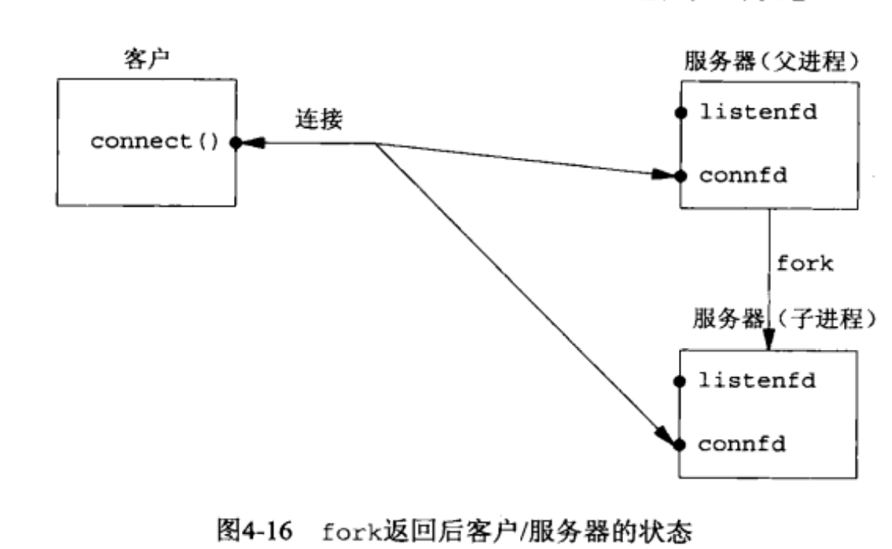

# Cpp-WebServer
学习cpp服务器编程
### Day1

这次提交是实现了最简单的客户端与服务端通信连接。

在Linux服务端中，总体逻辑：

1. 确定服务端IP地址与端口号
2. 创建socket文件描述符
3. 将socket文件描述符与ip地址、端口号进行绑定
4. socket文件描述符放入监听队列，查看socket文件描述符是否有客户端连接
5. 接受客户端的连接，返回新的socket文件描述符，通过该文件描述符进行通信。

在客户端中，总体逻辑：

1. 确定服务端IP地址和端口号
2. 创建socket文件描述符
3. 发起连接请求，通过已经创建的socket进行通信

#### 程序所需要的API

地址族


在通信过程中，不单单需要ip地址，还需要其他信息，因此设计了存储IP地址的结构体。

存储IP地址的专用地址结构体

```c++
#include<sys/socket.h>
//IPV4专用地址
struct socket_in
{
    sa_family_t sin_family;	//表示地址族类型 AF_INET或AF_INET6
    u_int16_t port;
    struct in_addr sin_addr;
};
struct in_addr
{
    u_int32_t s_addr;
};
//通用地址
struct sockaddr
{
    sa_family_t sa_family;
    char sa_data[14];
};
```

所有的专用地址在使用socket的API都需要强行转换成通用地址，可以直接强行转换。

在网络通信时，IP地址并不是常用的点分十进制形式，而且特殊的二进制形式，因此设计了将点分十进制转换成二进制数据

```c++
#include<arpa/inet.h>

in_addr_t inet_addr(const char *src); //将点分十进制转换成二进制数，并返回二进制数
int inet_aton(const char *src,struct in_addr *dest); //将IPv4地址转换到dest。
```

socket（套接字）是Linux/Unix设计进程间或应用间通信机制或接口。

创建socket文件描述符

```c++
#include<sys/types.h>
#include<sys/socket.h>

int socket(int domain,int type,int protoocl);
// domain:协议族，type：socket通信服务类型，protocol：由前两个参数共同决定，常用0（暂不了解）
/*
	type：sock_stream=tcp
		sock_ugram=udp
	成功返回socket文件描述符
	失败返回-1，并设置errno
*/
```

绑定socket地址，因为没有地址无法通行。

```c++
#include<sys/types.h>
#include<sys/socket.h>

int bind(int sockfd，struct sockaddr *addr,socklen_t addrlen);
/*
	成功返回0，失败返回-1并设置errno
*/
```

监听socket，是将待连接的客户端进行处理

```c++
#include<sys/socket.h>
int listen(int sockfd,int backlog);
// backlog:表示监听队列最大长度，成功返回0，失败返回-1并设置errn
```

发起连接

```c++
#include<sys/socket.h>
int conntion(int sockfd,struct sockaddr *serv_addr,socklen_t servaddr_len);
// 成功返回0，失败返回-1并设置errno
```

接受连接

```c++
#include<sys/socket.h>
int accept(int sockfd,struct sockaddr *client_addr,socklen_t *client_addr_len);
//成功返回新的sockfd进行通信，失败返回-1并设置errno
```

### Day2

本次提交主要用Cmake重构项目，使项目编译过简化，便于维护，其次实现echo功能，最后用一个函数来接受返回处理错误。

echo服务：客户端发送信息给服务端，服务端将信息回传给客户端。


#### 涉及API

```c++
// socket创建的文件描述符可以使用文件的read/write读写
// 这次主要介绍socket
ssize_t recv(int sockfd,void*buf,size_t len,int flags);	
/*
	sockfd写入len个字符，到buf。
	flag：读取控制，MSG_DONTWAIT--该操作非阻塞
*/
ssize_t send(int sockfd,const void*buf,size_t len,int flags);
/*
	buf中len字符写入sockfd中
*/

```

#### 修改部分

```c++
int connfd = accept(sockfd, (sockaddr *)&client_addr, &clt_addr_len);
Dealerrno(connfd==-1,"accept失败");
if (connfd < 0)
{
    std::cout << "errno is " << errno << std::endl;
}
else
{
    //成功打印客户端ip和端口号
    char remote[INET_ADDRSTRLEN];
    inet_ntop(AF_INET,&client_addr.sin_addr,remote,INET_ADDRSTRLEN);
    std::cout<<"connected with ip:"<<remote<<" and port:"<<ntohs(client_addr.sin_port)<<std::endl;
    char buf[MAX_LENTH];
    while(true)
    {
        memset(buf,0,sizeof(buf));
        ret = recv(connfd,buf,sizeof(buf),MSG_WAITALL);
        if(ret == 0)
        {
            std::cout<<"client already closed!\n";
            close(connfd);
        }
        ret =send(connfd,buf,sizeof(buf),MSG_WAITALL);
        Dealerrno(ret==-1,"send失败");
    }
}

#include "User.h"
void Dealerrno(bool flag, std::string msg)
{
    if (flag)
    {
        std::cout << msg << "\n";
        exit(-1);
    }
}
```

### Day3

由于之前实现的echo服务器，只能连接一个客户端，无法处理多个客户端同时通信。因此，想实现多个客户端进行echo服务。

通过分析，客户端代码并不需要特殊的变动。而在服务端需要修改。因为，程序运行是一条已规划好的直线，从开始到结束。

程序运行时，计算机会分配给程序一定的资源，而计算机在管理这样的程序的方式是将这些程序，视为进程，其包括程序运行的资源和特殊的编号等。一个代码运行后，一般情况下处理一种问题（或执行一种功能），如day2中代码，当程序运行过accept函数后，不会在运行accept函数，程序不会往后退，因此day2只能接受一个客户端连接。

现在我们需要accept函数多次执行，接受多个客户端服务器，因此思路是将accept函数放入循环中，循环接受客户端连接。这里就出现了问题：每个客户端都需要进行echo服务，只要客户端不断开连接，echo服务就不会暂停。而在循环中，却不是这样。

因此为了使服务端在接受客户端连接，就需要执行echo服务，这需要程序在accept进行分叉，一部分进行继续用于接受客户端，另一部分用来进行echo服务（即进行工作）。这衍生出多进程编程方法。

```cpp
#include<unistd.h>
pid_t fork(void);
// 创建子进程，父进程的副本。
// 在父进程中，返回值是子进程进id，在子进程返回值为0
```

通过这个函数，程序将父进程之前的资源全部复制给子进程。而文件描述符比较特殊，当其被复制时，文件描述符中引用计数器会增加1，表示指向该文件描述符的增加1，直到引用计数器变为0，才会释放连接。



因此，核心流程

```c++
/*
	while(true)
	{
		...
		connfd = accept();
		if(fork() == 0)
		{
			//子进程
			//	关闭监听sockfd
			//执行任务
			//任务结束，关闭connfd
			//退出子进程
		}
		//父进程
		//关闭conned
	}
*/
```

这样就能实现多个客户端连接服务端，进行echo服务器。但服务端不知道哪些子进程是否还在执行任务，哪些子进程退出了。

因此，需要增加父子进程的通信，当子进程结束前告知父进程。LInux/Unix提供了许多进程间通信的函数接口。

```c++
int pipe(int fd[2]);
//	创建一个管道，fd[0]读端，fd[1]写端
//	成功时返回0，失败返回-1设置errno

//修改后的核心流程
/*
	while(true)
	{
		...
		connfd = accept();
		int pipfd[2];
		pipe(pipfd);
		if(fork() == 0)
		{
			//子进程
			//	关闭监听sockfd
			//	关闭pipfd[0]
			//执行任务
			//任务结束，关闭connfd
			//	向pipfd[0]告知父进程
			//退出子进程
		}
		//父进程
		//关闭pipfd[1];
		//读取pipfd[0];
		//打印消息
		//关闭conned
	}
*/
```

### Day4

#### select实现聊天室功能

本次提交是从一个新的分支（chatroom）实现聊天室功能，多个客户端可以通过服务端进行通信交流。这个分支要将聊天功能不断迭代，最终想要实现类似QQ或微信的应用。

因为需要连接多个客户端，服务端可以采用IO复用API来处理此问题。我会实现select，poll和epoll这三个IO复用API。

在客户端代码逻辑：首先创建sockfd，向服务端地址发起连接，将sockfd在select上注册，然后进入死循环，判断sockfd事件是否就绪（读，写），通过select来分辨。注意：客户端是通过标准输入，因此需要将标准输入的文件描述符也要加入select上注册。然后将标准输入的字符复制到sockfd上，这样sockfd就不会有写事件，只会有读事件。

在服务端代码逻辑：创建sockfd，绑定地址并监听，然后将sockfd在select注册，然后进入死循环，有三类事件：新连接connfd到达并将其在select注册，读事件（分辨是哪个连接，并将信息分发给其他连接），写事件（同理可得）。

问题1:首先在客户端出问题不知道讲哪些文件描述符进行监听（通过看书才知道，标准输入也是一个文件描述符，可以通过监听标准输入，然后将标准输入的数据发送给connfd。因此标准输入与connfd都只需要监听读事件即可）。同理，在服务端的问题，不知道如何管理多个客户端连接（可以通过整型数组进行管理，通过循环便利查看是否连接）。其次，需要监听什么事件（当一个客户端发送数据时，该连接读事件，然后将数据发送给其他连接，因此所有文件描述符都监听读事件）

问题2:在服务端接收到会出现重复发送字符串。


```c++
        for (int i = 0; i < USER_LIMIT; i++)
        {
            curfd = fd[i];
            if (curfd != -1 && FD_ISSET(curfd, &readfds))
            {
                memset(buf, '\0', BUFFER_SIZE);
                ret = recv(curfd, buf, BUFFER_SIZE-1, 0);
                printf("get %d bytes of client data %s from %d\n", ret, buf, curfd);
                if(ret >0)
                {
                    buf[ret]=0;
                    printf("%d >> %s\n",curfd,buf);
                    for(int j=0;j<USER_LIMIT;j++)
                    {
                        if(-1 != fd[j] && fd[j]!=curfd)
                            send(fd[j],buf,strlen(buf),0);
                    }
                }
                else
                {
                    printf("客户端:%d 已断开连接\n",curfd);
                    fd[i] = -1;
                    user_count--;
                    close(curfd);
                }
            }
        }
```

暂时解决方法：只传输相同数量的字符。

####  poll实现聊天室

具体流程与select没什么区别，只是将IO复用的函数替换成poll。

在《高性能服务器》书上，用了一个结构体来存储客户端的数据，

```c++
struct client_data
{
    sockaddr_in address;	//客户端地址
    char *write_buf;		//客户端写缓冲	--通过指针，指向服务端接受的字符串减少复制开销
    char buf[BUFFER_SIZE];	//客户端读缓存
};
```

